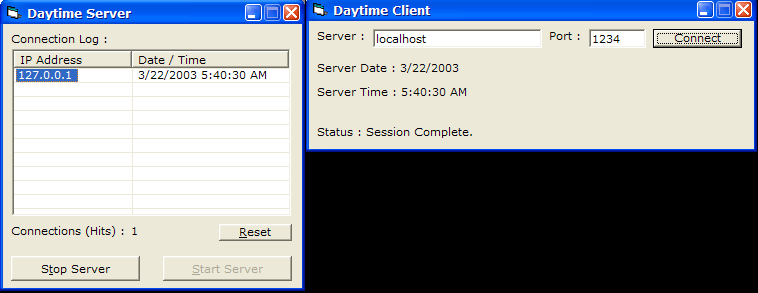



## Winsock Tutorial

### Description

I wrote this tutorial for beginners who have very little or no knowledge about the winsock control & client/server programming. I tried to explain things the best I could; so hopefully by after reading this tutorial you'll be on your way to making more advanced client/server applications. The tutorial comes with a sample client/server program which simulates the Microsoft Daytime Service, as an easy example of the basics. The tutorial itself is in Rich Text Format (*.rtf) and can be opened (cleanly) with Wordpad or Microsoft Word. Leave comments so I know if this has helped anyone. :)
 
### More Info
 

             |
---                |---
**Submitted On**   |2003-03-22 05:48:12
**By**             |[Daniel W\. Elkins](https://github.com/Planet-Source-Code/PSCIndex/blob/master/ByAuthor/daniel-w-elkins.md)
**Level**          |Beginner
**User Rating**    |5.0 (20 globes from 4 users)
**Compatibility**  |VB 3\.0, VB 4\.0 \(16\-bit\), VB 4\.0 \(32\-bit\), VB 5\.0, VB 6\.0, VB Script, ASP \(Active Server Pages\) , VBA MS Access, VBA MS Excel
**Category**       |[Complete Applications](https://github.com/Planet-Source-Code/PSCIndex/blob/master/ByCategory/complete-applications__1-27.md)
**World**          |[Visual Basic](https://github.com/Planet-Source-Code/PSCIndex/blob/master/ByWorld/visual-basic.md)
**Archive File**   |[Winsock\_Tu1562933222003\.zip](https://github.com/Planet-Source-Code/daniel-w-elkins-winsock-tutorial__1-44179/archive/master.zip)

